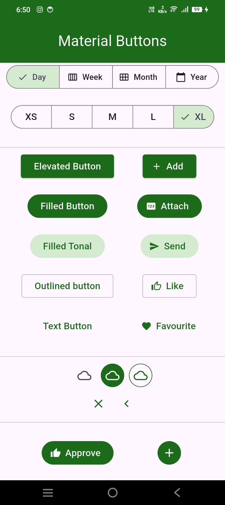
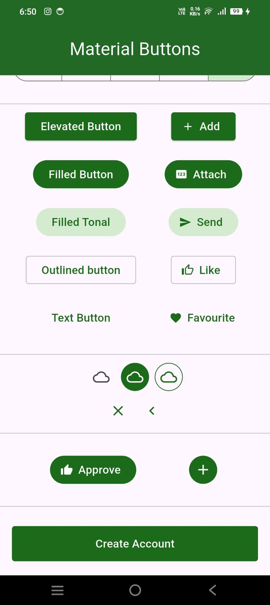
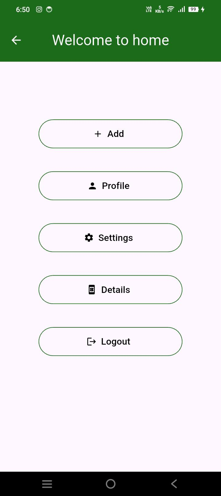
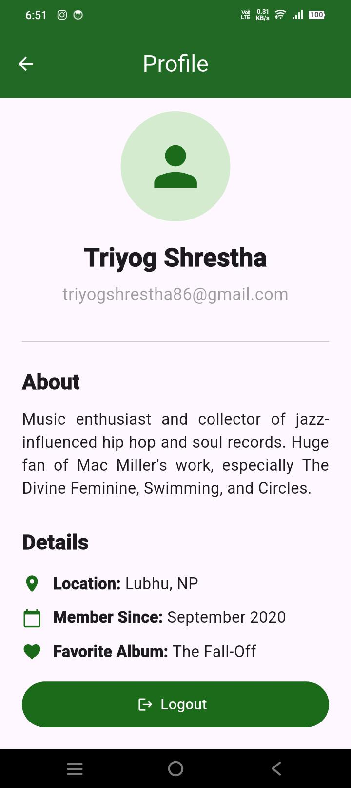
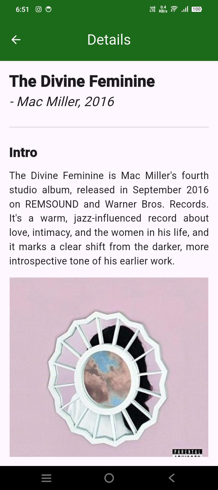
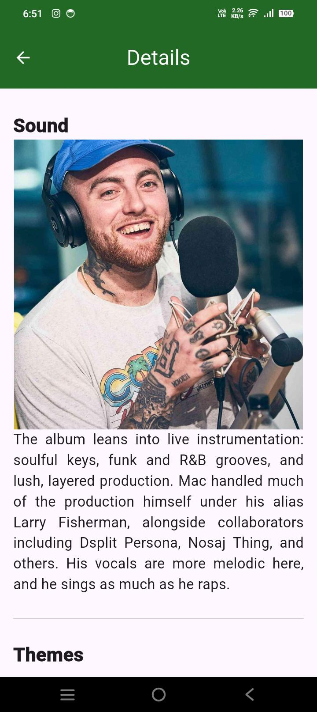
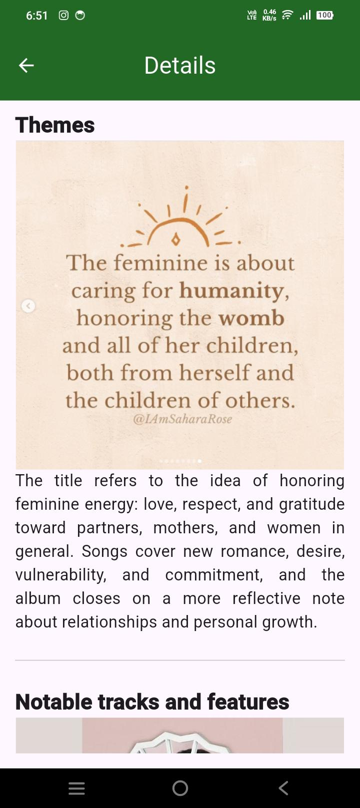
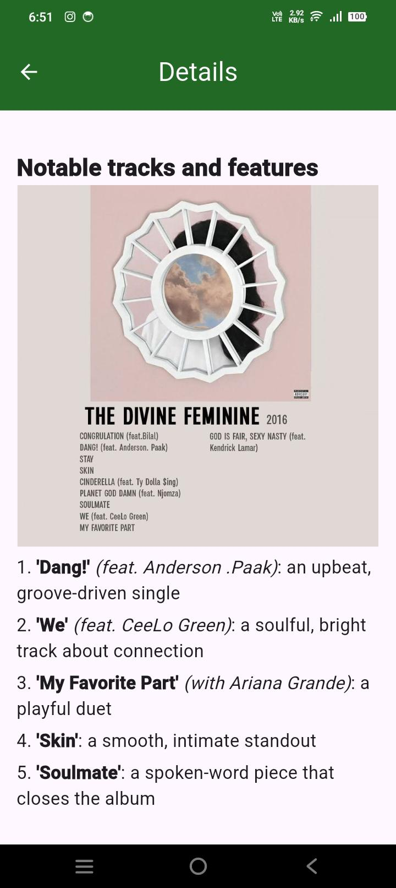
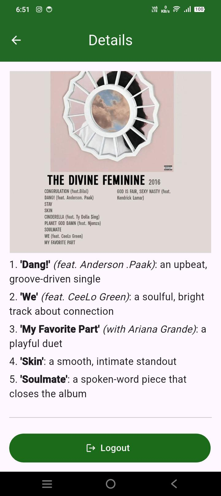

# A small Flutter app

A comprehensive Flutter application demonstrating various Material 3 buttons, segmented controls, custom navigation flows, user profiles, and detailed content pages.

---

## App Overview & Features

1. **Buttons & Controls Screen (`buttons.dart`)**:
   - Showcases Material 3 buttons: Elevated, Filled, Filled Tonal, Outlined, Text Buttons.
   - Icon Buttons in various styles (Standard, Filled, Outlined).
   - Interactive `SegmentedButton` components for single and multi-selection (Days/Weeks/Months/Years and Sizes XS–XL).
   - "Create Account" navigation button.

2. **Home Dashboard (`home.dart`)**:
   - Central hub after account creation / login.
   - Navigation buttons to **Profile**, **Settings**, **Details**, and **Logout**.

3. **Profile Page (`profile.dart`)**:
   - Clean user profile UI with avatar, user details (Name, Email), About section, and personal info rows (Location, Member Since, Favorite Album).

4. **Details Page (`details.dart`)**:
   - Detailed music album showcase (Mac Miller's *The Divine Feminine*).
   - Features structured headings, album artwork image, and notable tracks/features with formatted typography (**bold** song titles and *italicized* features).

---

## App Screenshots Walkthrough

Below are screenshots capturing the different screens and states of the application:

### 1. Buttons & Controls Screen

*Figure 1: The main Buttons screen featuring SegmentedButtons, Material 3 button variants, and icon buttons.*

### 2. Segmented Button Selection

*Figure 2: Interactive state demonstration of SegmentedButtons.*

### 3. Home Dashboard

*Figure 3: Home navigation dashboard providing access to Profile, Settings, Details, and Logout.*

### 4. User Profile Page

*Figure 4: User profile screen displaying user information, bio, location, and details.*

### 5. Album Details Page (Intro & Artwork)

*Figure 5: Details screen showing album overview and cover artwork.*

### 6. Album Details Page (Sound & Themes)

*Figure 6: Album sound and thematic breakdown section.*

### 7. Album Details Page (Notable Tracks & Features)

*Figure 7: Notable tracks list with bold song titles and italicized guest features.*

### 8. Additional Screen View 1

*Figure 8: Additional app view showing scrollable layout and button groupings.*

### 9. Additional Screen View 2

*Figure 9: Additional app view showcasing button alignment and styling.*

---

## Getting Started

1. Clone the repository and navigate to the project directory.
2. Run `flutter pub get` to install dependencies.
3. Run `flutter run` to launch the app on an emulator or connected device.
